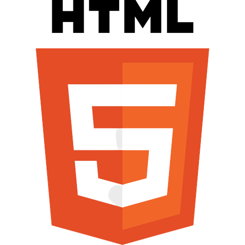
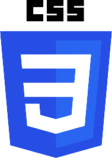
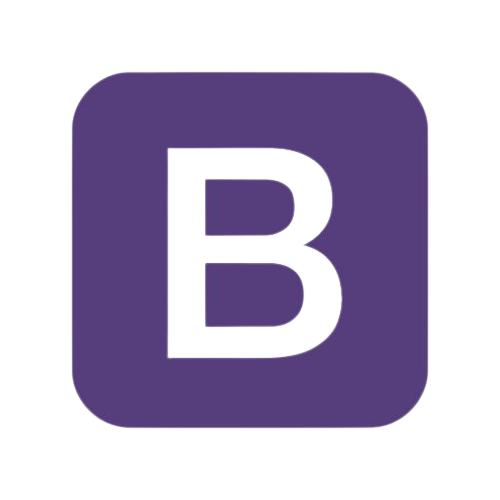
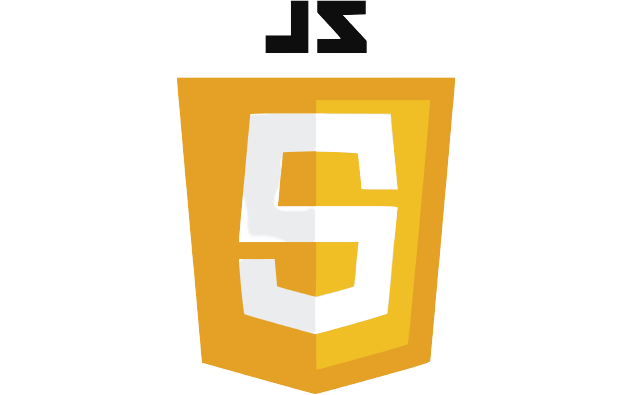

### Hi there! 👋 

### ✍️**About Me**

---
🎓 I am Vaishali Tyagi  (Specializing in Front End Development) Completed my Bachelors in Computer Science & Engineering.

**Languages and Tools we used:**

    

:book: I'm always trying to grow and learn something new. Now, I'm currently learning Full Stack Development with NodeJs.

:sparkles: Outside the world of tech too. I love pushing myself to develop new skills like Dancing.

### Social :iphone:

---
You can find me on the following social media platforms or send me an email. 
+ [Linkedin](https://www.google.com)
+ [Instagram](https://www.google.com)
+ vaishalicareer11@gmail.com

